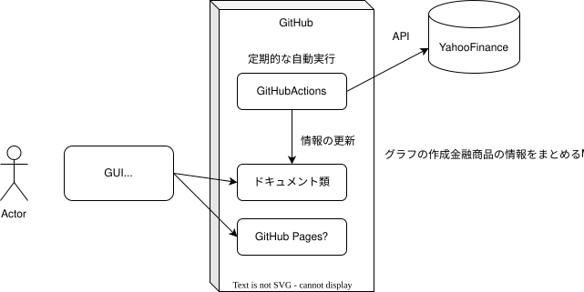

## 要件定義書

### 1. はじめに

#### 1.1. 目的

本ドキュメントは、Pythonを用いた株価解析コード作成プロジェクトにおける要件定義を記述するものである。

#### 1.2. 範囲

本ドキュメントは、株価解析コードの機能要件、非機能要件、およびシステム環境に関する要件を定義する。

### 2. システム概要

#### 2.1. システム名称

株価解析コード

#### 2.2. システムの目的

指定した株価、金融商品の情報をグラフや表を用いて可視化し、分析を支援する。

#### 2.3. システムの構成

Pythonで記述された株価解析コード、GitHub Actionsによる定期実行、GitHub Pagesによる結果表示で構成される。

### 3. 機能要件

| ID | 機能名 | 説明 | 優先度 |
|---|---|---|---|
| F01 | 株価データ取得 | 指定した株価、金融商品のデータを取得する。 | 高 |
| F02 | グラフ作成 | 取得したデータに基づき、グラフを作成する。 | 高 |
| F03 | 表作成 | 取得したデータに基づき、表を作成する。 | 高 |
| F04 | Markdown出力 | 作成したグラフと表をMarkdown形式で出力する。 | 高 |
| F05 | 定期実行 | GitHub Actionsを用いて、コードを定期的に実行する。 | 高 |
| F06 | 結果表示 | GitHub Pagesを用いて、Markdown形式の結果を表示する。 | 高 |

### 4. 非機能要件

#### 4.1. 性能

* グラフおよび表の作成、Markdown出力は、それぞれ1分以内に完了すること。

#### 4.2. 可用性

* システムは、週5日24時間稼働すること。

#### 4.3. セキュリティ

* GitHubのセキュリティ機能に準拠すること。

#### 4.4. 運用保守性

* コードは、可読性、保守性に配慮して記述すること。
* GitHub Actionsの設定は、容易に変更できるように記述すること。

#### 4.5. ユーザビリティ

* 結果表示は、ブラウザで容易に閲覧できるようにする。

### 5. システム環境

#### 5.1. ハードウェア

* GitHub Actionsの提供する環境を利用する。

#### 5.2. ソフトウェア

* Python 3.x
* 必要なライブラリ (Pandas, Matplotlib, etc.)
* GitHub Actions
* GitHub Pages

### 6. テスト要件

#### 6.1. 単体テスト

* 作成した関数は、単体テストを実施する。

#### 6.2. 結合テスト

* GitHub Actionsを用いて結合テストを実施する。
* 結合テストの詳細は後日調査する。

### 7. ステークホルダー

* 自分（ユーザ）

### 8. 利用想定

* ユーザはブラウザ経由でGitHub Pagesにアクセスし、株価解析の結果を確認する。

### 9. その他

* 本要件定義は、必要に応じて更新される場合がある。

---

**備考**

* 上記はあくまで要件定義の例であり、実際のプロジェクトではより詳細な内容を記述する必要があります。
* 各項目の内容は、プロジェクトの特性に合わせて適宜修正してください。
* WBSについては、Issueで管理するかどうかを検討する必要があります。